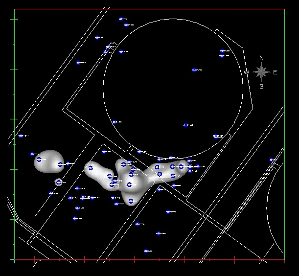

# Data_Visualization
These are examples of selected data visalization projects I have worked on.  I have used various languages from Python and R and programs such as Voxler and C-Tech Visualization System. 

