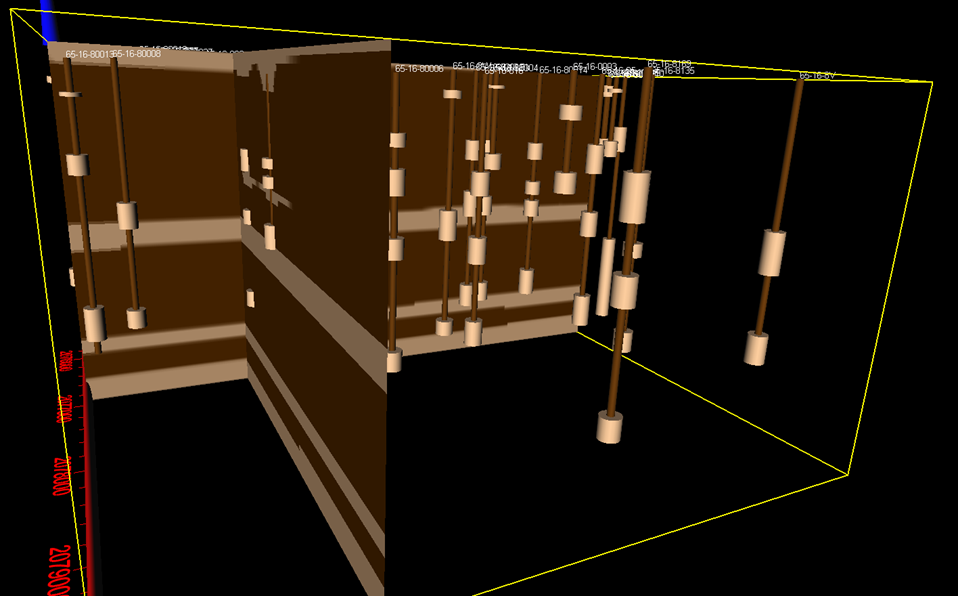

# Data_Visualization
These are examples of selected data visalization projects I have worked on.  I have used various languages from Python and R and programs such as Voxler and C-Tech Visualization System. 

C-Tech Environmental Visualization System with a CAD image as base image

A map of the cross Section for a project in Houston Texas.  A EPA Superfund site is located in the San Jacinto River.  The surrounding communties were concerend about possible migration of the contiminate into their private wells.  The map was created with Global Mapper.

* <a href="https://www.epa.gov/tx/sjrwp">San Jacinto Superfund Site</a>

A model of the area depicted in the cross section.  The model was built using Voxler. The brown is clay and the tan is sand.  The well data was historical well data obtained from local drilling companies and the Texas Submitted Drillers Reports Database.  Most well reports were from from the 1960's.  
